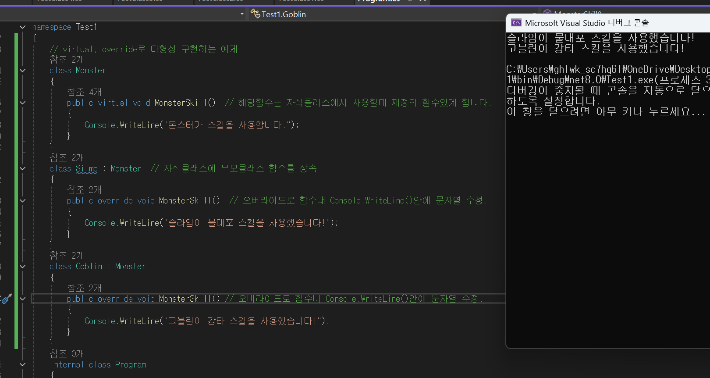

## 다형성이란?

정의 : 다형성이란 하나의 객체가 여러형태를 가질수 있는 능력을
의미한다.

### 다형성의 장점

1. 코드의 유연성 

    - 동일한 코드를 다양한 객체에서 재사용할수 있어 코드의 유연성이 증가합니다.

2. 유지 보수성 향상

    - 코드의 변경이 용이하며, 확정성이 높아집니다.

3. 다양한 객체 처리

    - 하나의 인터페이스나 부모 클래스를 통해 다양한 객체를 일관된 방법으로 처리할 수 있습니다.

### 다형성의 2가지 형태

1. 오버로딩(컴파일 타임 다형성)

    오버로딩은 같은 이름의 함수를 여러개 가지되, 매개변수의 종류나 개수가 다르게하여
    여러 상황에서 사용할 수 있도록 하는 기법이다. 즉, 하나의 함수 이름으로 여러기능을
    할 수 있게 하는 것.

2. 오버라이딩(런타임 다형성)

    오버라이딩은 상속받은 클래스에서 부모 클래스의 함수를 새로운 방식으로 재정의하는 것을 말한다. 부모 클래스의 기능을 자식 클래스가 필요에 따라 바꿔서 사용할 수 있다.

예시 사진

