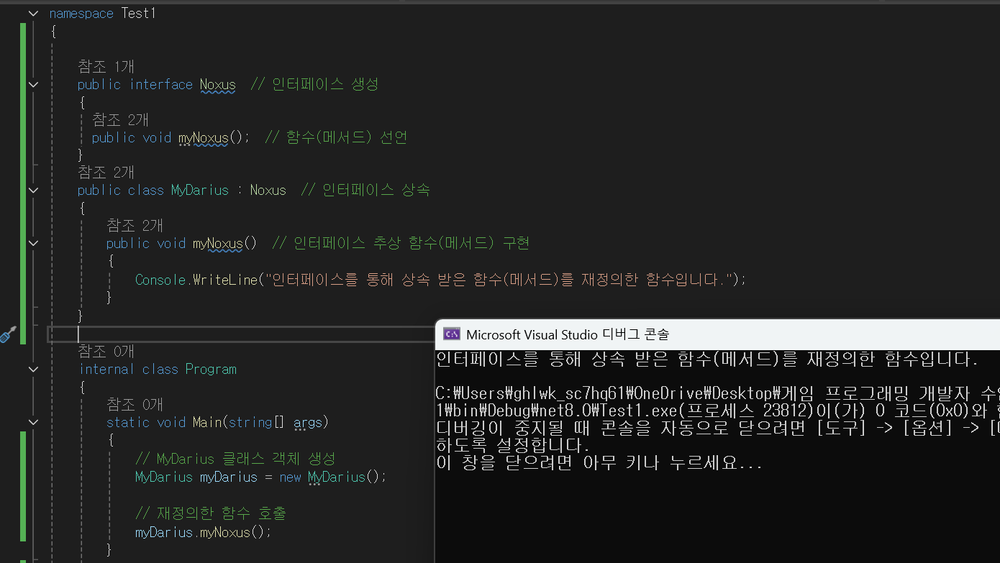

## 추상화란?

정의 : 추상화란 복잡한 시스템의 핵심적인 특징만을 뽑아내어
단순화하고, 불필요한 구현 세부 사항을 감추는 것을 말합니다.

### 추상화의 장점

1. 단순화

    - 복잡한 구현을 숨기고, 필요한 기능만을 외부에 노출합니다. 이를 통해 사용자는 내부 동작 방식을 몰라도 객체의 기능을 활용할 수 있습니다.

2. 핵심 추출

    - 관련된 객체들의 공통적인 데이터와 기능을 뽑아내어 상위 클래스(추상 클래스)나 인터페이스를 만듭니다.

3. 확장성:

    - 상속을 통해 새로운 클래스를 쉽게 추가할 수 있도록 설계하여 시스템을 유연하게 확장할 수 있게 합니다.

4. 다형성

    - 추상 클래스나 인터페이스를 통해 다양한 하위 클래스들이 동일한 인터페이스를 구현하도록 하여 다형성을 지원합니다. 

### 추상화를 구현하는 두가지 방법

1. 추상 클래스 (Abstract Class)

    - 추상 클래스 : abstract 키워드를 사용합니다.
    - 클래스들에서 공통적으로 사용되는 변수나 메서드를 추출하여 추상 클래스를 만들 수 있습니다. 추상 클래스는 객체를 만들 수 없고, 상속을 하는 역할로만 사용합니다. 추상 클래스에는 추상 메서드를 선언하는데 정의하지는 않고 추상 메서드의 정의는 자식 클래스에서 진행합니다.

예시 사진

2. 인터페이스 (Interface)

    - 인터페이스 : interface 키워드를 사용합니다.
    - 인터페이스는 추상 클래스와 비슷하지만, 모든 멤버가 추상 메서드와 상수로만 이루어져 있습니다. 인터페이스를 구현하는 클래스는 인터페이스에서 정의한 모든 메서드를 반드시 구현해야 합니다. 
    - 인터페이스는 다중 상속을 지원하며, 클래스의 계층 구조를 유연하게 설계할 수 있도록 도와줍니다.

예시 사진

